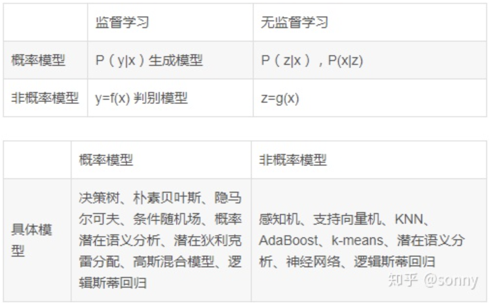
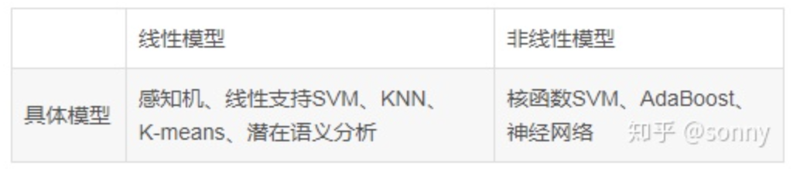

# 内容
人工智能基础(机器学习、神经网络、深度学习等基本概念、模型)

## 人工智能
### 基本概念
人工智能(AI-Artificial intelligence )就是让计算机帮助人类解决问题，它可以被看成是这个领域的总称。我将它区别于软件工程。在软件工程中，我们更专注于如何编程，从而让计算机执行某项任务。在今天，人工智能几乎包含现实世界的方方面面，毫不夸张的说人工智能已经无处不在了。随着现代化带来的便利，有些已经被我们习以为常的事物，已经不会被大家当成是人工智能了。比如，路径导航，联想输入，全文搜索等，这些我们日常生活中常常用到的功能，在几十年前它们就属于人工智能的研究方向。而现在，这些技术只是被当成理所当然的了。（动物研究中也有类似的趋势，“能够使用工具”曾经被认为是智人的定义之一，但是当我们发现“章鱼也能打开罐子”或者“乌鸦竟能解决字谜”时，智人的这个标准也随之被提升。同样，我们也可以认为人工智能主要是专注于那些计算机还不能熟练解决的问题。）

### 模型

## 机器学习
### 基本概念
机器学习(Machine Learning)我们可以把它看作人工智能的一个子集。 其中的核心是“学习”，而不是通过人来教会机器完成某项工作。机器学习系统是通过大量的样本对计算机进行训练，从而使机器获取解决问题的能力，而不是直接告诉机器解决某个问题的方法。

我们可以把训练机器学习系统比作教小朋友学习：我们提供许多例子来对儿童进行训练，并给他们足够的反馈信息，让他们知道是对还是错。 一个更好的类比是训练警犬 - 特别是训练它们做一些人类能力范围之外的任务，比如甄别炸弹等危险品。 我们对警犬进行很多的训练，但是我们并不能准确地告诉它们如何做。我们能做的只是每当他们找到目标以后，给予相应的奖励。之后，它们就知道了哪些特征对它们来说是可以获得奖励的，而这些反馈的结果等同于“找到了炸弹”。

在机器学习之前，人工智能（那时人们通常称其为专家系统）可能已经很“聪(wan)明(shan)”了，但其背后的工作原理是我们已经明确地告诉它们一切必要的知识。专家系统就好比对照着一份庞大的列表清单来进行工作。我们不可否认，使用这样的清单是非常有效的决策方式，但是构建这样一份完备的清单是非常耗时的。同时这类清单只能狭隘地解决一个特定领域的问题：比如诊断某一类疾病或对某种型号的飞机进行安全检查。

机器学习的核心是“使用算法解析数据，从中学习，然后对世界上的某件事情做出决定或预测”。通过建立一组仅能由机器识别的特征，机器学习系统就能用这些特征对目标示例进行泛化。比如，通过一组猫的图片与狗的图片让机器学习进行学习，提取猫与狗的不同特征，从而构建出分类网络。这个分类网络就能够对测试图片（未识别过的新图片）进行相同的任务，分辨出图片中的是狗还是猫。就目前的发展来看，我们完全可以将机器学习和人工智能划上等号。虽然专家系统和类似的一些方法仍然有其存在的意义，但我们已经不把它们称为人工智能了，就像前面提到的门槛已经变高了。

#### 一般分类
1. 监督学习  
    概念：监督学习是从<x, y>这样的示例对中学习统计规律，然后对于新的X，给出对应的y。  
    步骤：  
    算法：  
   - K-近邻(KNN)  
   - 线性回归  
   - 逻辑回归  
   - 支持向量机  
   - 决策树和随机森林  
   - 神经网络  

2. 无监督学习
    概念：只有一个X，没有Y，需要你对X进行处理得出你未知的结果。也就是有两个数据，从一个推测出另一个，前提是有样例作为参考，作为学习的“教材”。无监督学习相比监督学习没有标注数据，也就是Y。无监督学习是从一堆数据中学习其内在统计规律或内在结构，学习到的模型可以是类别、转换或概率。这些模型可以实现对数据的聚类、降维、可视化、概率估计和关联规则学习。    
    步骤：  
    算法：  
   - 聚类算法：k-平均算法(k-means)、分层聚类算法、最大期望算法(EM)
   - 可视化与降维：主成分分析(PCA)、核主成分分析、局部线性嵌入、t-分布随机近临嵌入
   - 关联规则学习：Apriori、Eclat

3. 半监督学习
    概念：半监督学习包含大量未标注数据和少量标注数据。主要是利用未标注中的信息，辅助标注数据，进行监督学习。例如说上传的照片都是大量未标注数据，但会有重复的同一个人的照片，可以通过无监督学习进行分类；如果你为其中一份照片标注了信息，则可以为其他未标注的数据标注信息。大多数半监督学习算法是无监督式和监督式算法的结合，例如深度信念网络(DBN)。它基于一种互相堆叠的无监督式组件，这个组件叫作受限玻尔兹曼机(RBM)。    

4. 强化学习
    概念：使用的未被打标签的数据。而强化学习使用机器的个人历史和经验来做出决定。强化学习的经典应用是玩游戏。与监督和非监督学习不同，强化学习不涉及提供“正确的”答案或输出。相反，它只关注性能。这反映了人类是如何根据积极和消极的结果学习的。很快就学会了不要重复这一动作。  

5. 主动学习
    概念：主动学习是机器不断给出实例进行人工标注，然后使用标注数据学习预测模型的机器学习问题。主动学习的目标是对学习最有帮助的实例人工标注，以较小的标注代价，达到最好的学习效果。  

#### 按模型分类
1. 概率模型和非概率模型  
    分类：  
2. 线性模型与非线性模型
    分类：  
3. 参数化模型和非参数化模型
    分类：  
    
### 模型

## 神经网络
### 基本概念
神经网络(Neural networks)是目前实现机器学习比较有效的方法之一。虽然现在“神经网络”的热度很高，但机器学习并非一定要使用神经网络，使用其他看似普通的架构也能达到不错的效果。如果没有一点相关的知识，想要解释清楚到底什么是神经网络是有难度的，而我在这个系列之后的文章中会有涉及具体的细节。 概括的说，神经网络是由非常简单的组件组成的复杂系统，它们将单个任务分解成多个子任务进行学习。某种程度上来说神经网络是借鉴了真正的神经元的工作模式，但我认为从长远来看，人工智能系统远达不到真正的人脑能力。就像飞机的翅膀模仿的是鸟类，但目前飞机的翅膀远远达不到鸟类翅膀的功能。
### 模型

## 深度学习
### 基本概念
深度学习（Deep learning）是指一类神经网络。它有着特定的技术含义，但如今也成了这个领域的流行语。“深”，这里指的是网络架构具有多层结构。(三层我们就称为“深”。而一层，我们则称之为“浅”)。实际工作中，我们发现深层网络可以比单层网络能更有效地进行学习和推理。通过将虚拟神经元堆叠成层次结构，我们可以表现更多样本的特征。
### 模型
